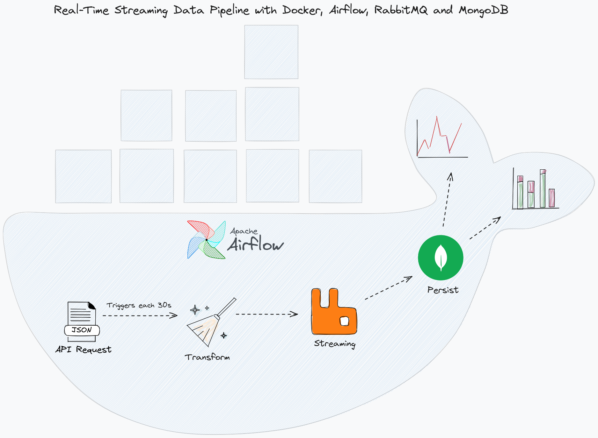

# Real-Time Streaming Data Pipeline

## Overview
This project was developed by Eduardo Passos, and it implements a real-time streaming data pipeline using Apache Airflow, RabbitMQ, and MongoDB within a Dockerized environment. It's designed to fetch data from an external API, process it, and store it for further analysis or real-time applications.

## Architecture

### Components

1. **Data Source**
   - **Purpose**: Fetches data from an external API (`https://randomuser.me/api/`).
   - **Benefits**: Provides fresh and real-time data for processing.

2. **Airflow Scheduler**
   - **Purpose**: Triggers DAGs (Directed Acyclic Graphs) to execute at scheduled intervals.
   - **Benefits**: Ensures timely and regular data fetching, maintaining the consistency of the data flow.

3. **Airflow Worker**
   - **Purpose**: Executes the tasks defined in the DAGs, such as data fetching and processing.
   - **Benefits**: Enables scalable and parallel processing of data.

4. **RabbitMQ**
   - **Purpose**: Acts as a message broker to decouple data processing and data storage.
   - **Benefits**: Provides a reliable and scalable way to handle message queues, ensuring that data is not lost between processing steps.

5. **Data Processor**
   - **Purpose**: Consumes messages from RabbitMQ and processes or formats them as needed.
   - **Benefits**: Offers flexibility in data processing and enables additional processing layers if required.

6. **MongoDB**
   - **Purpose**: Stores the processed data.
   - **Benefits**: Offers a scalable and flexible NoSQL database for storing large volumes of data with varied structures.

7. **Airflow Webserver**
   - **Purpose**: Provides a user interface to monitor and manage the Airflow DAGs.
   - **Benefits**: Enhances the user experience with easy monitoring and operational capabilities for the data pipeline.

## Setup

To set up and run this pipeline, I used Docker and Docker Compose and a Dockerfile to install the necessary libs.

## Conclusion

This real-time streaming data pipeline leverages modern data engineering tools to efficiently process and store data, ensuring scalability, reliability, and ease of monitoring and management.
